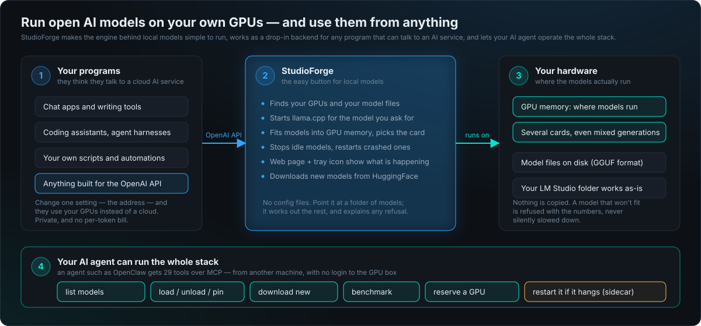
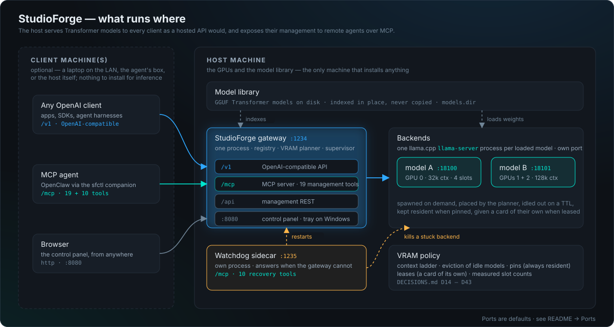
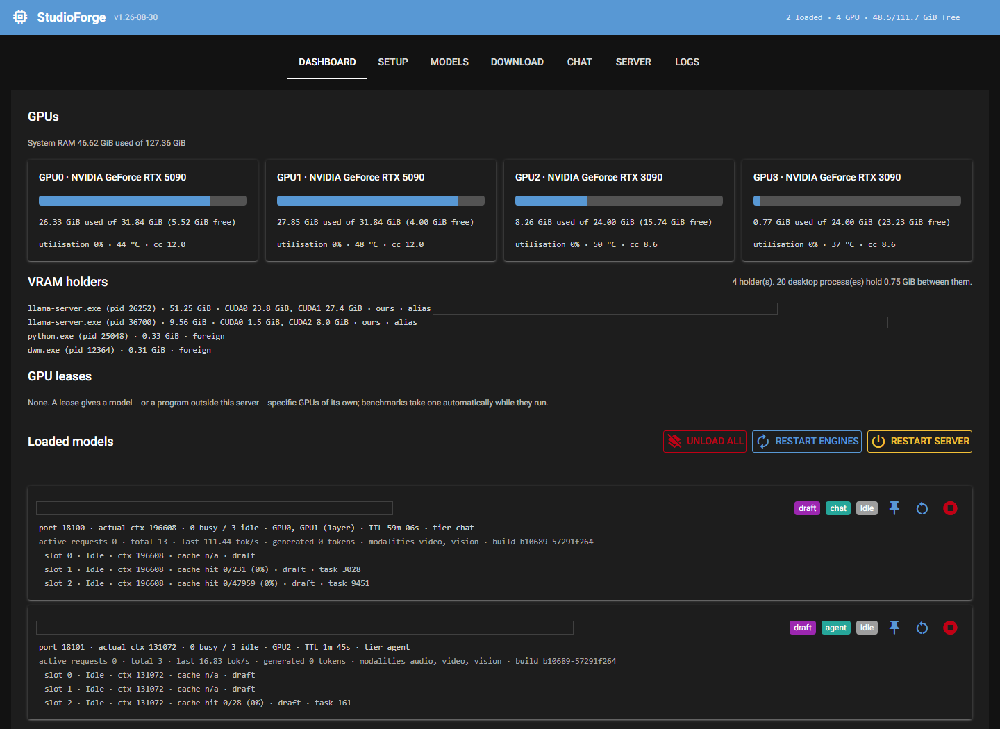
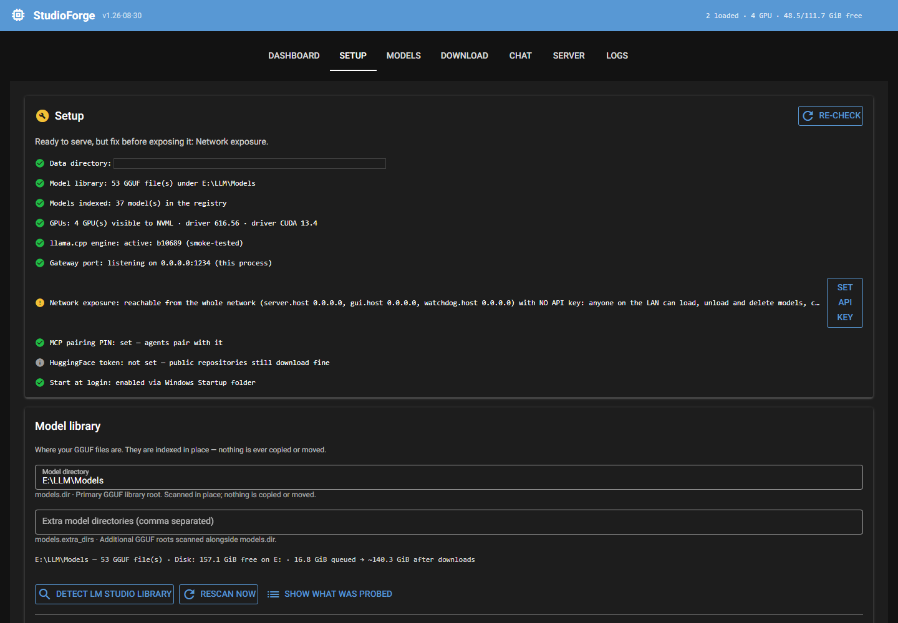
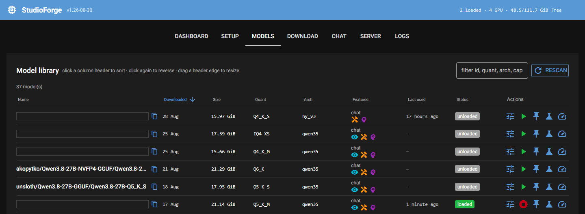
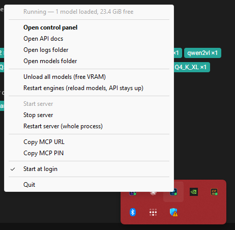

# StudioForge

[](https://github.com/LaserLloyd/StudioForge/actions/workflows/ci.yml)
[](LICENSE)

A self-hosted, **GPU-only** LLM server: an OpenAI-compatible gateway over
[llama.cpp](https://github.com/ggml-org/llama.cpp)'s `llama-server`, with a model registry, a VRAM
planner, a web control panel, a system tray, and an MCP control plane for agents. Built to replace
LM Studio as the backend for [OpenClaw](docs/OPENCLAW.md) — it listens on LM Studio's port, so
switching is a host change, not a rewrite.

**Status:** v1.26-08-30. Windows is the reference platform and runs it daily; Linux is supported (CI
runs both) and less battle-tested. Questions and bug reports: [Contact](#contact).

**On versions.** StudioForge is calendar-versioned: a major, then the release date. The display
version lives in `src/studioforge/__init__.py` — `1.26-08-30` — and is what `GET /api/version`,
`GET /health`, the MCP `server_status` tool and `sfctl status` report. PEP 440 has no way to spell
a hyphenated date, so both `pyproject.toml` files carry the same date as `1.26.8.30`, which is what
`pip`/`uv` see in the wheel metadata; the `sfctl` companion ships from the same release and carries
the same version, and release tags are `v1.26-08-30`. Check what a server is actually running with
`curl -s <host>/api/version`.

---

## Overview

### In plain English

<p align="center"></p>

Three ideas: your programs keep talking to the API they already know and just get a new address;
StudioForge runs the engine behind local models for you — finding GPUs and model files, fitting
models into memory, restarting what crashes — so you never write a config file; and your AI agent
can operate all of it from another machine. The rest of this section is the technical version.

### Technical brief

**Why it exists.** Running Transformer models on your own GPUs leaves you without the operational
layer a hosted API takes for granted: an endpoint every client already speaks, capacity planning
across the cards, recovery when a process wedges, and — above all — *remote* management, so the
machine running your agent is not the machine running your models. StudioForge is that layer. It
puts llama.cpp backends (one `llama-server` process per loaded GGUF model) behind the OpenAI API,
and puts their **management** — load, unload, pin, benchmark, lease GPUs, recover — behind
[MCP](https://modelcontextprotocol.io), so an agent such as OpenClaw can operate the GPU host from
another machine with no shell on it.

**What it is not.** It does no inference of its own, it never offloads to CPU, and it never phones
home: a model runs entirely in VRAM or is refused with the numbers, and the only outbound requests
are the ones you ask for.

<p align="center"></p>

### Components

| Component | Runs on | Role |
| --- | --- | --- |
| **Host machine** | The box with the NVIDIA GPUs and the GGUF library | Runs everything below. The only machine that installs anything. |
| **Gateway** (`:1234`, one process) | Host | Four surfaces: `/v1` the OpenAI-compatible API; `/mcp` an MCP server with 20 management tools; `/api` the management REST; `:8080` the control panel (plus a system tray on Windows). Inside: the registry, the VRAM planner and the supervisor. |
| **Backends** — `llama-server` | Host, one process per loaded model, each on its own internal port | [llama.cpp](https://github.com/ggml-org/llama.cpp)'s server, pinned to a tested build and fetched automatically. Spawned on demand, placed by the planner, idled out on a TTL, kept resident when pinned, given a card of their own when leased. A crash takes down one model, never the gateway. |
| **Model library** | Host, on disk (`models.dir`) | Your GGUF Transformer models, indexed in place — the same folder LM Studio uses; nothing is copied or moved. |
| **Watchdog sidecar** (`:1235`) | Host, a separate process | Its **own MCP server** with 10 recovery tools — restart the gateway, kill a stuck backend, reclaim VRAM, tail logs — reachable when the gateway is wedged, because it is not the gateway. |
| **VRAM policy** | Host, inside the planner | The context ladder, eviction of idle models, pins, leases and measured slot counts — every rule with its measurement in [`DECISIONS.md`](DECISIONS.md) D14–D43. |
| **Client machine(s)** | Anything on the LAN or tailnet — a laptop, a NAS, the agent's box; or the host itself | Nothing to install for inference: any OpenAI client points at `:1234/v1`. For management, the [`sfctl` companion](#the-companion-sfctl) (no GPU, no CUDA) bridges both MCP servers into one toolset. |

### How a request flows

1. A client `POST`s to `/v1/chat/completions` naming a model — or `local-model`, which resolves to
   `models.default_model`.
2. The gateway looks the model up in the registry. If a backend is already serving it, the request
   is proxied straight through, streaming intact.
3. Otherwise the VRAM planner chooses a placement: which GPUs, what context (walking a ladder down
   from `models.target_ctx` until it fits), which KV cache type, how many parallel slots. It may
   evict *idle* models when policy allows; it never touches a pinned model, a leased card, or a
   model mid-request.
4. The supervisor spawns a `llama-server` on an internal port, waits for it to pass health, and the
   request proceeds. The backend idles out after its TTL unless pinned.
5. Everything else — loading ahead of time, pinning, leasing a card, benchmarking, downloading —
   happens over `/mcp` or `/api`; if the gateway itself stops answering, the sidecar's tools on
   `:1235` restart it.

### Why it is worth running

- **It tells the truth about VRAM.** A model runs entirely on GPU or it is refused with the
  numbers and a fix — never silently spilled to CPU at a twentieth of the speed.
- **Multi-GPU is planned, not guessed.** Placement across mixed cards, context sized to what
  fits, measured slot counts, pins for models that must always be warm, and leases that give a
  model a card of its own ([`DECISIONS.md`](DECISIONS.md) D14–D43, each with its measurement).
- **The chat model comes first.** A load can say what it is — `priority: 1` the model a person
  is chatting with, `2` a dispatched agent, `3` (or nothing) background. A chat load takes the
  fastest placement (idle background models are moved off its cards and reloaded afterwards
  where they fit), jumps the load queue, and holds background traffic off while it loads;
  background can never displace it. The tier is saved per model (`settings.priority`), so it
  survives a restart instead of quietly falling back to background; a single request can state
  its own tier in the body of a chat completion; and traffic held off while a better-tier load
  runs is refused with the distinct code `priority_hold` and a `Retry-After` worth honouring
  ([`DECISIONS.md`](DECISIONS.md) D46, D48).
- **Drop-in for LM Studio.** Same port, same `/v1/models` behaviour, same library on disk —
  switching a client is a host change.
- **Built for agents.** 30 MCP tools with a catalog that hands an agent the exact load
  arguments, a benchmarking playbook it can follow, and recovery tools that survive a wedged server.
- **One call answers "do I even need to load anything?"** `check_loaded_model(min_params="20b",
  vision=true)` asks whether what is *already* resident clears the bar — size, and capabilities
  like vision, tools, thinking or uncensored — and a yes comes back with the model id to send the
  work to, so an agent skips a 40-second load or a cloud fallback it did not need. Nothing the
  server cannot prove is allowed to pass ([`DECISIONS.md`](DECISIONS.md) D52).
- **Recovers on its own.** Tray, watchdog, crash restarts with backoff, and VRAM that cannot
  outlive its owner process.
- **Private by construction.** Nothing leaves the box unless you ask for it.

### Where to go next

| You want to… | Go to |
| --- | --- |
| Install it on the host | [Install](#install) — [Windows](#windows) · [Linux](#linux) |
| Have an AI coding agent install it for you | [A. Let an AI coding agent do it](#a-let-an-ai-coding-agent-do-it) |
| Call it from an app or SDK | [B. Manually, as an API](#b-manually-as-an-api-any-openai-compatible-client) |
| Drive it from OpenClaw / an MCP agent | [C. With OpenClaw](#c-with-openclaw-or-any-mcp-agent) · [the companion](#the-companion-sfctl) |
| See the control panel | [What it looks like](#what-it-looks-like) |
| Know which ports to open | [Ports](#ports) |
| Keep your data outside the checkout | [Data directory](#data-directory) |
| Double-click instead of typing | [Windows launchers](#windows-launchers) |
| Read more | [Documentation](#documentation) |
| Ask a question or report a bug | [Contact](#contact) |

---

## Install

### Windows

1. Install [Git](https://git-scm.com/download/win), [Python 3.12+](https://www.python.org/downloads/)
   and [uv](https://docs.astral.sh/uv/getting-started/installation/). Have a current
   [NVIDIA driver](https://www.nvidia.com/drivers/) — the CUDA 13 engine builds need a 580-series
   driver or newer (no CUDA toolkit needed: the prebuilt engine ships its runtime).
2. Clone:

   ```bash
   git clone https://github.com/LaserLloyd/StudioForge.git
   ```

3. Double-click **`launchers\Update StudioForge.bat`** — creates the virtualenv, installs the
   dependencies, then installs the **newest** llama.cpp release that has a build your driver can
   run, smoke-tests it, and only then activates and pins it. A build that fails its smoke test is
   installed but never made active (D49). (`b10425` is the build the numbers in these docs were
   measured on, not necessarily the one you will get.)
4. Double-click **`launchers\Start StudioForge.bat`**. The control panel opens at
   <http://127.0.0.1:8080> on its **Setup** tab — a checklist with a button for each unmet item.
   (Prefer a notification-area icon that keeps the server alive and restarts it if it crashes?
   Use **`launchers\StudioForge Tray.bat`** instead, and open the panel from the icon's menu.)

### Linux

1. Install [Git](https://git-scm.com/downloads), [Python 3.12+](https://www.python.org/downloads/),
   [uv](https://docs.astral.sh/uv/getting-started/installation/), `cmake`, and the
   [CUDA toolkit](https://developer.nvidia.com/cuda-downloads) whose `nvcc` matches your driver.
   Upstream ships no Linux CUDA archive, so the engine is **built from source once per version**.
2. Clone and install:

   ```bash
   git clone https://github.com/LaserLloyd/StudioForge.git && cd StudioForge
   uv venv --python 3.12 .venv
   uv pip install --python .venv/bin/python -e ".[dev]"
   ```

3. Start it (the first run builds the engine; watch the progress in the terminal):

   ```bash
   .venv/bin/studioforge serve --open
   ```

4. To run it as a service that survives logout, use the systemd user units in
   [`deploy/`](deploy/README.md).

### First run, either platform

The Setup tab asks you to confirm three things: the engine is installed, `models.dir` points at
your GGUF library (**Detect LM Studio library** finds an existing one — models are indexed in
place, never copied), and you have noted the MCP pairing PIN you will need for an agent. The full
walkthrough, with the headless YAML/CLI equivalent, is [`docs/SETUP.md`](docs/SETUP.md).

---

## Three ways to set it up

Install once (above), then pick whichever of these matches how you will use it — or let an agent
do the install for you.

### A. Let an AI coding agent do it

Open [Claude Code](https://docs.anthropic.com/en/docs/claude-code), a DeepSeek-based harness, or
any coding agent that can run shell commands **in the cloned folder**, and paste:

> Install StudioForge on this machine by following `docs/SETUP.md`: create the virtualenv with uv,
> install the llama.cpp engine with `studioforge engine --update`, point `models.dir` at my GGUF
> library, start it with `studioforge serve --open`, and confirm `GET http://127.0.0.1:1234/health`
> reports `"can_serve": true`. Only run `tests/unit`, never `tests/contract`.

The repo is written for that: [`DECISIONS.md`](DECISIONS.md) explains every non-obvious rule,
[`docs/RUNBOOK.md`](docs/RUNBOOK.md) says what each `/health` field means, and
[`docs/BENCHMARKING.md`](docs/BENCHMARKING.md) is a playbook an agent can follow verbatim.

### B. Manually, as an API (any OpenAI-compatible client)

Once the server is up, it *is* a cloud-style API on your own hardware. Point any OpenAI client at it:

```bash
export OPENAI_BASE_URL=http://<studioforge-host>:1234/v1
export OPENAI_API_KEY=not-required        # any non-empty string while server.api_key is unset
```

```bash
curl http://<studioforge-host>:1234/v1/chat/completions \
  -H "Content-Type: application/json" \
  -d '{"model": "<id from /v1/models>", "messages": [{"role": "user", "content": "hello"}]}'
```

```python
from openai import OpenAI  # https://github.com/openai/openai-python
client = OpenAI(base_url="http://<studioforge-host>:1234/v1", api_key="not-required")  # scrub-ok: the literal string clients send when auth is off
print(client.models.list())   # every downloaded model; naming an unloaded one loads it on demand
```

`GET /v1/models` lists every **downloaded** model, like LM Studio, and a request that names an
unloaded model just-in-time loads it. To use it from outside your LAN, set `server.api_key` on the
Setup tab and pass that key — see [`docs/SETUP.md` §6](docs/SETUP.md#6-network--access).

### C. With OpenClaw (or any MCP agent)

Inference is path B. Management — load, unload, pin, benchmark, download, recover — is one stdio
MCP server on the agent's machine, provided by the companion package:

```bash
uv build --wheel -o dist                                              # in packages/studioforge-companion, on the host
uv tool install ./studioforge_companion-<version>-py3-none-any.whl    # on the agent's machine
sfctl servers add rig http://<studioforge-host>:1234 --api-key <PIN or server.api_key> --use
```

OpenClaw's config key is `mcp.servers`, not the top-level `mcpServers` map:

```bash
openclaw mcp add studioforge --command sfctl --arg mcp
```

```json
{ "mcp": { "servers": { "studioforge": { "command": "sfctl", "args": ["mcp"] } } } }
```

Claude Code, Cline, LibreChat and other clients that take the generic map want this instead:

```json
{ "mcpServers": { "studioforge": { "command": "sfctl", "args": ["mcp"] } } }
```

That gives the agent 30 tools: the server's 20 management tools plus the watchdog's 10 recovery
tools, so it still holds `restart_server` when the main server is wedged. The step-by-step
two-machine install with a check after each step is
[`docs/OPENCLAW-SETUP.md`](docs/OPENCLAW-SETUP.md); the loop an agent actually runs is
[`docs/OPENCLAW.md`](docs/OPENCLAW.md).

---

## What it looks like

Every number in the panel is the *actual* one the engine reports — context, slots, VRAM per card:



| Setup — a checklist, not a YAML file | Models — the library, indexed in place |
| --- | --- |
|  |  |

On Windows, the tray starts the server, restarts it if it crashes, and keeps the everyday actions
one right-click away:

<p align="center"></p>

## The companion: `sfctl`

[`packages/studioforge-companion`](packages/studioforge-companion/) installs anywhere — no CUDA, no
server dependencies — and is the remote control for the host: `sfctl status` (GPUs, loaded models and
any standing GPU lease), `models load/unload/pin`, `models options` and `models load-recommended` (the
planner's per-mode table, and a load that refuses rather than silently shrinking your context),
`search` and `models repo` (find a GGUF on Hugging Face, then read its headers for a real fit verdict),
`leases` (claim cards so nothing else is planned onto them), `download`, `logs`, `config`, `update`,
and `sfctl recover` for when the server is wedged.
`sfctl mcp` is the stdio MCP bridge from path C.

## Ports

| Service | Default | Purpose |
| --- | --- | --- |
| Gateway / management API | `1234` | OpenAI-compatible endpoints, `/api/*`, `/mcp` |
| Web GUI | `8080` | The control panel |
| Watchdog | `1235` | Recovery MCP sidecar (separate process) |
| `llama-server` children | `18100–18200` | Internal, one port per loaded model |

LM Studio also uses `1234`: quit it, or set `server.port`. With no `server.api_key` (the default)
anyone on your LAN can read, chat and load/unload; anything that changes the *box* — config,
engines, files, restarts — needs a browser or client on the machine itself, or the MCP PIN
([DECISIONS.md](DECISIONS.md) D32). Set a key to manage it remotely: it is accepted on `/v1`,
`/api`, `/mcp` and the watchdog, and it sits *beside* the PIN rather than replacing it — both MCP
endpoints keep accepting either.

## Data directory

Everything the app writes — `config.yaml`, `registry.sqlite3`, `engines/`, `logs/`, `downloads/` —
lives in one place: `SF_DATA_DIR` if set; else the folder a `--config` file lives in; else
`<repo>/data` in a checkout (gitignored); else the platform data directory. To keep your data
outside the checkout, copy [`launchers\local-env.example.bat`](launchers/local-env.example.bat) to
the repo root as `local-env.bat` and set `SF_DATA_DIR` there (Linux: export it in your shell or the
systemd unit). Every launcher reads it, and it is gitignored.

One data directory serves one running instance; a second server on the same directory comes up
read-only (`"instance": "secondary"` in `/health`). Stop the old server and tray before pointing a
new checkout at an existing data directory.

## Windows launchers

All in [`launchers/`](launchers/); none need a terminal or admin rights, and they work from a
desktop shortcut.

| File | What it does |
| --- | --- |
| **Start StudioForge.bat** | Starts the server and opens the control panel once it is actually up |
| **StudioForge Tray.bat** | Notification-area icon: starts the server, restarts it if it crashes, start/stop, free VRAM, copy the MCP URL |
| **Open StudioForge GUI.bat** | Opens the control panel of an already-running server |
| **StudioForge Autostart.bat** | Turns "start when I log in" on or off (tray, or server only) |
| **Update StudioForge.bat** | Pulls code (if a git remote exists), syncs dependencies, then installs the newest llama.cpp engine, smoke-tests it, and activates and pins it **only if that passed**; rescans the library. Skips the engine step entirely while a server is answering on `:1234`, since it would overwrite binaries the loaded models are executing — use the panel or `POST /api/engine/install` + `/api/engine/activate` instead |

The same from a terminal, on any platform: `studioforge serve --open`, `studioforge gui`,
`studioforge scan`, `studioforge config`, `studioforge engine --check | --update`,
`studioforge autostart enable`.

## Project layout

| Path | What lives there |
| --- | --- |
| `src/studioforge/` | The app: `api/` (gateway + management routes), `core/` (registry, VRAM planner, supervisor, engine, leases, benchmarks, downloader), `gui/`, `mcp/` (20 tools), `tray/`, `watchdog/` (10 tools), `migrations/` |
| `packages/studioforge-companion/` | `sfctl` and the `sfctl mcp` bridge |
| `launchers/` | Windows double-click launchers |
| `deploy/` | Linux systemd user units |
| `docs/` | Setup, OpenClaw, the catalog, benchmarking, the runbook, limitations |
| `tests/unit/` | The suite CI runs (no GPU, no network); `tests/contract/` needs real engines and weights, opt-in |
| `DECISIONS.md` | The architectural decision log, D1 onward — the *why* behind every rule |
| `config.example.yaml` | Every config key with its shipped default, annotated |

## Documentation

- [`docs/SETUP.md`](docs/SETUP.md) — first run, tab by tab; GPUs, engine, network, downloads; headless
- [`docs/OPENCLAW-SETUP.md`](docs/OPENCLAW-SETUP.md) — two-machine install, verified step by step
- [`docs/OPENCLAW.md`](docs/OPENCLAW.md) — the tool list and the loop an agent runs; pins and leases
- [`docs/CATALOG.md`](docs/CATALOG.md) — the model catalog an agent picks from, every column explained
- [`docs/BENCHMARKING.md`](docs/BENCHMARKING.md) — the benchmarking playbook
- [`docs/OPENCLAW-LONG-CONTEXT.md`](docs/OPENCLAW-LONG-CONTEXT.md) — what a long window really costs
- [`docs/ENGINE-FEATURES.md`](docs/ENGINE-FEATURES.md) — llama.cpp features on, off, and measured
- [`docs/RUNBOOK.md`](docs/RUNBOOK.md) — what `/health` means and what to do when it is wrong
- [`docs/DEVELOPMENT.md`](docs/DEVELOPMENT.md) · [`CONTRIBUTING.md`](CONTRIBUTING.md) — working on the code, running the tests
- [`docs/RELEASING.md`](docs/RELEASING.md) — the version scheme, cutting a tag, what the updater expects
- [`docs/LIMITATIONS.md`](docs/LIMITATIONS.md) · [`docs/COMPARISON.md`](docs/COMPARISON.md) — known limits; what was borrowed from Ollama, oobabooga, KoboldCpp, vLLM
- [`DECISIONS.md`](DECISIONS.md) — architectural decisions, each with the measurement behind it

## Contact

StudioForge is built and maintained by **Lloyd** — [LaserLloyd.com](https://laserlloyd.com),
*"Laser and other technology projects. Free for your use."*

- Bugs, questions and ideas: [open an issue](https://github.com/LaserLloyd/StudioForge/issues)
- Email: [Lloyd@LaserLloyd.com](mailto:Lloyd@LaserLloyd.com) <!-- scrub-ok: the maintainer's published contact address, deliberate -->
- More projects: [github.com/LaserLloyd](https://github.com/LaserLloyd)

## License

**MIT** — see [`LICENSE`](LICENSE). Use it, fork it, ship it; keep the copyright notice.

The dependencies are permissive too (MIT, BSD, Apache-2.0) with one exception worth naming:
`pystray`, which draws the Windows system-tray icon, is **LGPL-3.0**. It is an unmodified
dependency installed by pip and imported at runtime — that is the arrangement the LGPL is written
for, and it does not reach into this project's own terms. If you redistribute a bundled or frozen
build that embeds it, the LGPL's relinking obligation is yours to satisfy.
